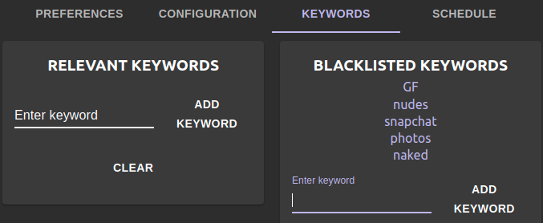
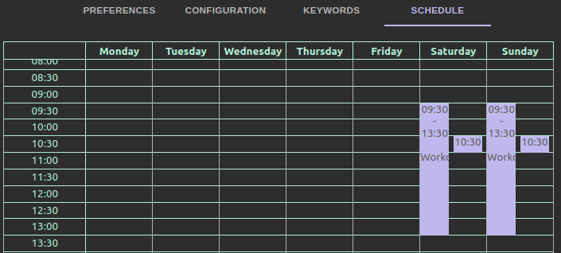
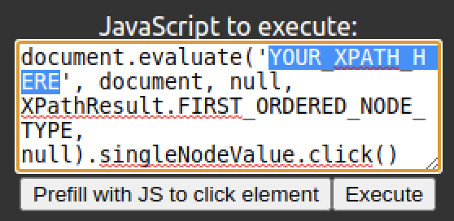
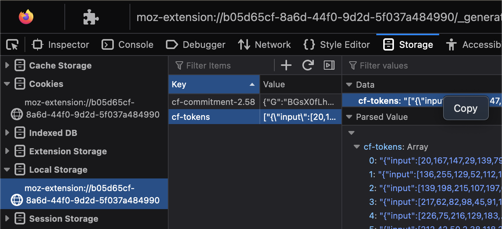
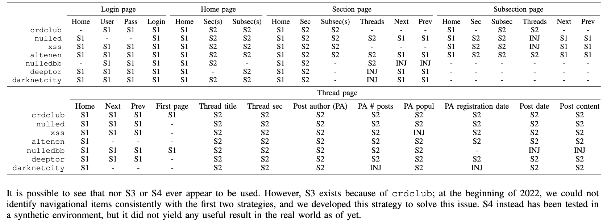

# THREAT/crawl

This is the repository containing the source code of THREAT/crawl, a prototypical web crawler developed within the context of the paper named _THREAT/crawl: a Trainable, Highly-Reusable, and Extensible Automated method and Tool to Crawl Criminal Underground Forums_ by Michele Campobasso <m.campobasso@tue.nl>, and Luca Allodi <l.allodi@tue.nl>, published at the 17th Symposium on Electronic Crime Research (APWG eCrime 2022). The pre-print version of the paper can be found at this [link](https://michelecampobasso.github.io/assets/papers/threatcrawl.pdf). 

The Appendix of the paper links to this page to reference some additional figures of the tool interface. Figures follow [here](#appendix-figures).


## Summary

This prototype aims at showcasing the strenghts of a guided procedure to configure a general purpose crawler to scrape new adversarial underground communities within the context of cybercrime monitoring. In addition, THREAT/crawl aims at keeping operations stealthy by using browser automation to explore the content of the target communities, modelling human behaviour and offering its users margins to finely tune crawler operations to achieve the desired tradeoff between stealth and throughput.[^1] The diversity of the underground ecosystem calls flexibility to interact with communities with non-standard interactions (e.g., loading dynamically generated content, and interacting with it); THREAT/crawl offers the possibility to extend its operations by defining simple procedures via JavaScript, or to obtain indications provided from the user to identify the relevant content within the page. Finally, THREAT/crawl allows to circumvent CAPTCHAs generated from CloudFlare protected websites by using [Privacy Pass](https://privacypass.github.io/)[^2].

## Building and installing THREAT/crawl

### Prerequisites

1. Install TOR Browser using `sudo apt install torbrowser-launcher`, run `torbrowser-launcher` to proceed with the installation and run Tor Browser for the first time to allow the creation of the TOR Browser profile.
2. Install `mongod` ([link](https://www.mongodb.com/try/download/community)) on the local machine or on a remote server. Note that in order to interact with a remote server it is necessary to forward traffic to `localhost:27017`.

#### Database preparation

After installing `mongod`, it is necessary to create a folder writable to the mongod process named `/data/db`.

```
sudo mkdir /data/db
sudo chmod 777 /data/db
```

It is necessary to create the proper user and database for THREAT/crawl to execute. It is possible to do it via [MongoDB Compass](https://www.mongodb.com/try/download/compass).
By default, THREAT/crawl expects to login using with the username "THREATcrawl", password "#t!JpQH9mt37", and database "THREATcrawl". These can be modified from the file `threatcrawl/config.json`. 

After connecting to mongo, from the GUI it's possible to create a new database (e.g., THREATcrawl) . From `mongosh` it is possible to create a new user:

```
db.createUser(
  {
    user: "THREATcrawl",
    pwd:  passwordPrompt(),   // #t!JpQH9mt37
    roles: [ { role: "readWrite", db: "THREATcrawl" } ]
  }
)
```

### Install from binary

You can install THREAT/crawl from binary instead of building it from sources. Note however that it will use the (!) default credentials (!), as reported in this README file. It is sufficient to run:

```
git clone https://gitlab.tue.nl/threat-crawl/THREATcrawl.git
cd THREATcrawl
bash threatcrawl_installer.sh
```


If the unzip process failed, make sure you installed ```torbrowser-launcher``` and you installed Tor Browser from there, and run Tor Browser at least once.  
If this was not the problem, then your problem is very likely that the profile for Tor Browser is not in that specific directory. During our tests, we noticed that the path was slightly different (we replaced `tor-browser_en-US` with `tor-browser_en-US`). If this is the case, you can run the following commands:
```
mkdir -p ~/.local/share/torbrowser/tbb/x86_64/tor-browser/Browser/Downloads
curl -o Browser.zip https://gitlab.tue.nl/threat-crawl/THREATcrawl/-/raw/master/Browser.zip?inline=false
unzip Browser.zip -d ~/.local/share/torbrowser/tbb/x86_64/tor-browser/Browser/TorBrowser/Data
```

### Build 

If you prefer to build THREAT/crawl from sources, follow the procedure below. Please note that in this repository there are `node_modules` and `package-lock.json` already available, as currently not all the libraries are available to download. 
We will update the relevant dependencies in the future. 

```
git clone https://gitlab.tue.nl/threat-crawl/THREATcrawl.git
cd THREATcrawl
bash threatcrawl_builder.sh
```
From the root folder of the git repository, the THREAT/crawl executable can be found in `threatcrawl/out/THREATcrawl-linux-x64/THREATcrawl`. When the build process succeeds, it creates a .deb file as well for the installation. To install THREAT/crawl on the system, run `sudo dpkg -i threatcrawl/out/make/deb/x64/threatcrawl_1.0.0_amd64.deb`.

## Running THREAT/crawl

If you get this error:

```
FATAL:gpu_data_manager_impl_private.cc(415)] GPU process isn't usable.
```

then append to the executable the flag --no-sandbox [^3]


## Circumventing Cloudflare DDoS protection on TOR

You need to create tickets for CloudFlare on a Firefox browser.

### Prerequisites

1. Download Firefox
2. Install the [Privacy Pass](https://addons.mozilla.org/en-US/firefox/addon/privacy-pass/) plugin

#### Steps

From Firefox:
1. Earn tickets by visiting <https://captcha.website> and solving one or more CAPTCHAs. Each CAPTCHA solved rewards with 30 tickets.
2. Once tickets have been redeemed, visit <about:debugging#/runtime/this-firefox>
3. Click the button "inspect" for the "Privacy Pass" plugin
4. In the left frame, click on "Local storage" to access the tickets 
5. There are two cookies here (cf-commitment-*** and cf-tokens). Click on each of them and, in the frame on the right under the "data" panel there's the overview of that cookie. When asked from THREAT/crawl, right click on the overview of the cookie to copy it and paste it in THREAT/crawl prompt. 
6. Repeat step 5 for both of the cookies.

[](https://user-images.githubusercontent.com/22891185/218432487-201b5744-83df-476a-ae12-82cbb70b75d6.mp4)
 
[^1]: More information on stealth crawler operations in prior work: [CARONTE: a Crawler for Adversarial Resources Over Non-Trusted, high-profile Environments](https://arxiv.org/abs/2009.08148).
[^2]: Related paper: [Privacy Pass: Bypassing Internet Challenges Anonymously](https://www.petsymposium.org/2018/files/papers/issue3/popets-2018-0026.pdf).
[^3]: https://github.com/Automattic/simplenote-electron/issues/3044#issuecomment-979289305

## Appendix figures



*Figure 5. Keywords definition in the configuration interface.*



*Figure 6. Overview of the scheduler configuration interface.*



*Figure 7. JavaScript injection module prefilled with a ``click-on-element'' script.*



*Figure 8. Screenshot of the tickets available in the source browser.*



*Table VI. Summary of the strategies used to derive identifiers during the training.*

______________
